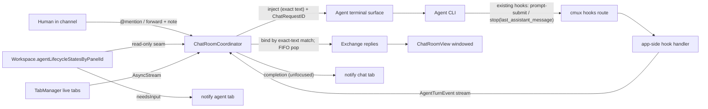

# cmux AI Chat Room — Design & Implementation Plan

> Status: **Draft for review (rev 2)** · Author: Dylan (with Claude) · Date: 2026-06-06
> Review loop: Codex reviews this doc → Claude addresses comments → repeat to convergence → execution.

### Revision history

- **rev 1** — initial spec.
- **rev 2** — incorporates Codex review round 1 (3 independent reviewers, all "Not Ready") after verifying every claim against the code. Major changes: (a) reuse the **existing** cmux agent pipeline — hooks (`CLI/CMUXCLI+AgentHookDefinitions.swift`), launch (`Packages/CMUXAgentLaunch`), lifecycle (`Workspace.agentLifecycleStatesByPanelId`), and the `stop` hook's existing `last_assistant_message` payload — instead of building parallel infrastructure; (b) **token-based correlation** (bind `ChatRequestID` at `prompt-submit` by exact injected-text match; per-surface FIFO `prompt-submit → stop`); (c) fix package layering with a low `CmuxChatRoomCore`; (d) single source of truth for lifecycle; (e) central `WorkspaceRole`-aware close policy; (f) explicit persistence/migration; (g) correct CI test gating; (h) "Step 0" infra audit; (i) UX: richer `@`-autocomplete rows, no busy-handling, full (non-collapsed) messages, channel windowing + "load earlier", new-agent failure states, accessibility/reduced-motion.

---

## 1. Background

### Why this exists

Dylan runs a disciplined multi-agent coding workflow:

```
create-plan → plan-review → plan-execution → code-review
```

with two cooperating roles:

- **Coder agent:** create-plan → address-review-comment → plan-execution → address-review-comment
- **Review agent:** review-plan → code-review

In practice Dylan often pairs **Claude Code as the coder** and **Codex as the reviewer**, because the models have complementary strengths (below). Today this is done by hand — copying text between separate terminal windows — which is tedious and loses track once more than two agents are involved.

### The hard-won philosophy behind the workflow

These beliefs are *requirements in disguise*; the product must protect them:

1. **Review is additive only when a human coordinates toward convergence.** A fully automated Codex⇄Claude `while` loop burned ~60% of a weekly token allowance, executed a plan that was bad from the start, drifted in scope hop-to-hop, and produced something that didn't work. Lesson: **the human holds the canonical intent and gates every hop.** Deliberate friction is a feature — anywhere the tool is tempted to auto-advance a hop, the answer is *no*.
2. **An agent should never be both coder and reviewer in one session.** Authors are biased toward "ship it"; reviewing must be a separate session/agent.
3. **Different models have different shapes.** Codex analyzes better than it codes (it will say "this plan is beyond saving" — the sane, scope-saving call). Claude codes well but is eager-to-please ("is it better now?") and shallower in analysis. Route work to the model whose shape fits.
4. **Agency on both sides is additive** — a coder that can reject a reviewer's claim, a reviewer that can say "not addressed, no-go" — *when a human arbitrates.*
5. **Independent convergence is signal.** Spawn N agents on the same question; if they *independently* converge, that's the obvious answer. Independence is what makes it meaningful — agents must be **blind to each other.**

### What we're building

A fork of **cmux** (native macOS terminal app with vertical tabs) turned into an **AI chat room**: a pinned, Slack-channel-style tab that orchestrates a set of agent terminal tabs via `@mentions`, collects each agent's *final* message back into the channel, and lets the human forward messages between agents — while every agent tab remains a fully interactive coding-agent terminal.

The chat room is an **adjudication and coordination surface** — not a consensus engine, not a wrapper that hides the real sessions. It makes coordination fast and legible; it never removes the human from the loop.

---

## 2. References

### Upstream / fork

- Upstream cmux: https://github.com/manaflow-ai/cmux
- This fork: https://github.com/asura1234/cmux_chat_room
- Binding rules (read first): [`CLAUDE.md`](../../../CLAUDE.md) — package architecture, Swift 6 concurrency, file organization, localization, test wiring, socket policies.

### Existing infrastructure we BUILD ON (verified — the feature is mostly orchestration over these)

| Concern | File · symbol | Notes |
|---|---|---|
| Tab **is** a Workspace | `Sources/TabManager.swift:16` | `typealias Tab = Workspace` |
| Tab presentation fields | `Sources/Workspace.swift:10293-10301` | `customTitle`, `customDescription`, `isPinned`, `customColor`, `groupId` exist |
| Sidebar tab row | `Sources/ContentView.swift:15048` | `TabItemView` (Equatable, snapshot-fed) |
| **Existing agent lifecycle** | `Sources/Workspace.swift:10559` | `agentLifecycleStatesByPanelId: [UUID:[String:AgentHibernationLifecycleState]]` |
| Lifecycle states | `Sources/AgentHibernation/AgentHibernationLifecycleState.swift:3` | `unknown / running / idle / needsInput` |
| Lifecycle mutation + CLI | `Sources/Workspace.swift:12287`; `Sources/TerminalController.swift:19378` | `setAgentLifecycle(...)`, `set_agent_lifecycle` CLI |
| **Existing agent hook defs** | `CLI/CMUXCLI+AgentHookDefinitions.swift:142-256` | hooks for claude/codex/cursor/gemini/… ; events `prompt-submit`, `stop`, `agent-response`, `session-end/-finalize` |
| **`stop` already carries final msg** | `CLI/CMUXCLI+OmpExtension.swift:192` | `sendHook("stop", ctx, { last_assistant_message })` |
| Hook → app routing | `cmux hooks <agent> <subcommand>` over `CMUX_SOCKET_PATH`; `Sources/WorkspacePromptSubmit.swift:86` (`lastAssistantMessage`); `CLI/FeedEventClassifier.swift:214` (`stop → .response`) | the feed already classifies turn-completion |
| **Agent launch infra** | `Packages/CMUXAgentLaunch/` (`HermesAgentHookConfig.swift`, `AgentSpawnIdentity.swift`, env policy, resume) | hook install + identity stamping; reuse for launch |
| Panel protocol (needs shim) | `Sources/Panels/Panel.swift:267` | `protocol Panel: AnyObject, Identifiable, ObservableObject` — **requires ObservableObject** |
| New terminal surface | `Sources/Workspace.swift:14522` | `newTerminalSurface(...)` |
| Inject text | `Sources/TerminalController.swift:18155,18290`; V2 `surface.send_text` `:2010` | prompt injection path |
| Close paths (scattered) | `Sources/TabManager.swift:5381,5402,5412,5423`; socket `closeWorkspace` `Sources/TerminalController.swift:18104`; UI `Sources/ContentView.swift:15482` | `canCloseWorkspace(_,allowPinned:)` gates on `isPinned`; **no role-aware single gate** |
| Persistence snapshots | `Sources/SessionPersistence.swift:1379` (`SessionTerminalPanelSnapshot`, has `agent`), `:1787` (`SessionWorkspaceSnapshot`, has `isPinned/groupId/customColor`) | **no agent-kind / workspace-role field yet** |
| Notifications hub | `Sources/TerminalNotificationStore.swift:822` | split notifications |
| Rename plumbing | `Sources/ContentView.swift:3138-3157`; `Sources/Workspace.swift:12076-12132` | command-palette + context-menu → `customTitle` |
| Package wiring exemplars | `Packages/CmuxSettings`(+UI), `Packages/CmuxSocketControl`, `Packages/CMUXAgentLaunch` | copy pbxproj shape |
| **CI package-test gate** | `.github/workflows/ci.yml:411-442` | `cmux-unit` does NOT run SPM tests; a `PACKAGES=(…)` list runs `swift test --package-path` per package — new packages MUST be added here |
| Localized strings | `Resources/Localizable.xcstrings`; `web/messages/{en,ja}.json` | EN + JA |

---

## 3. Product / UX design

> Mockups are the brainstorm artifacts rendered to PNG. Interactive HTML originals live under `.superpowers/brainstorm/` (gitignored). Note: mockups predate two later decisions — `~`-abbreviated paths, and richer `@`-autocomplete rows (§3.10).

### 3.1 Two tab types
One pinned **chat-room** tab (colored, always on top, **non-closable**) + N **agent** tabs. Bash tabs dropped — an agent tab is a real terminal (shell via the agent's `!`).


### 3.2 Sidebar — agent tabs (three lines + live status)
Editable title (auto-named "claude code 1"), then **~pwd**, then **branch on its own line**. Live lifecycle badge from the **existing** `agentLifecycleStatesByPanelId`: rotating green spinner = `running`, dim dot = `idle`, pulsing amber + `!` = `needsInput`.


### 3.3 Rename = title only
Double-click the title text → inline edit (pre-selected; Enter saves / Esc cancels). Same action via right-click → Rename and command palette → Rename Tab. pwd/branch read-only.


### 3.4 Routing rule — chat-origin replies only
An agent's final message returns to the channel **only** if the prompt came from the channel. Direct turns stay in the tab. Guaranteed by token correlation (§4.6), not heuristics.


### 3.5 Channel layout — grouped exchanges (one level deep)
Ordered list of **exchanges**: one outgoing prompt (`@mention` or forward) + the replies from its targets, grouped beneath. A forward is a *new* exchange — not a nested thread.


### 3.6 Exchange progress + stalled visibility
Each exchange shows **N/M replied**, who's still `running`, and any `needsInput` agent (amber, jump-to-tab). Status is read from the existing lifecycle state.


### 3.7 Message labeling + forward composer
Every reply is stamped with the origin agent's name + two subtitles, **snapshotted at send time**. Forward wraps the original in `"double quotes"` and lets you **append your own note** — the *steering wheel* (re-scope, narrow, reject a claim).


### 3.8 Full messages, no collapsing
Channel messages and the forward preview **always render in full** — no "read more" / truncation / collapse of any kind (a collapse invites skimming). Non-hiding affordances only: a **copy** button and a **go-to-source-tab** link per message.

### 3.9 Channel windowing ("load earlier")
For very long histories the channel keeps a **bounded recent window** scrollable (e.g. the most recent N exchanges). Scrolling to the top reveals a **"Load earlier"** button that pages older exchanges in from the persisted store on demand. Individual messages are never truncated; only the *count* of rendered exchanges is bounded for performance.

### 3.10 Mention targeting
You type/match the **name** (`@`), but each autocomplete **dropdown row shows name + kind + ~cwd + branch** so duplicate/renamed titles and "same repo, different branch" are distinguishable. Selection stores a **stable `AgentID`**, never the display string. The dropdown is **rebuilt fresh each time it opens** from the live roster, so every current agent tab is present and closed ones are absent.

### 3.11 Notifications (v1)
Disjoint events, no double-ring:
- **Completion** (chat-origin turn finished) → notifies the **chat-room tab** when unfocused.
- **Needs-input** (agent blocked) → notifies the **agent tab**. Never gates sending.

### 3.12 Accessibility
Status is never color/motion-only: each lifecycle state carries a **text/accessibility label** (`running` / `idle` / `needs input`). Honor **Reduce Motion** (spinner → static glyph) and high-contrast.

### 3.13 Explicit non-goals for v1 (YAGNI)
No `/poll` or slash-command framework; no automated review/apply loop; no interrupt-from-chat; no token/cost accounting (strong follow-on); no deep/nested threads; **no busy-state handling** — a prompt is always piped straight to the agent's own input queue (§4.6).

---

## 4. Engineering design

### 4.1 Constraints (from `CLAUDE.md`, binding)
Layered package DAG (Core → Services → Domain → UI → Executable), downward deps only. Swift 6 concurrency only (`actor`/`async`/`AsyncStream`/`@Observable`/`@MainActor`; no Combine/`@Published`/locks/`DispatchQueue.main.async`/completion handlers). Constructor DI; the executable is the single composition root. One type per file; DocC on public symbols. Snapshot boundary (rows get value snapshots + closures, never a store). No state mutation in view-body. Inject `UserDefaults`/`FileManager`/paths/clock. Swift Testing. Localization audit. Socket: no focus stealing; telemetry off-main.

### 4.2 Packages (layering fixed)

```
Packages/
  CmuxChatRoomCore/    # Core: pure Sendable DTOs, IDs, AgentEvent, protocol seams (no AppKit)
  CmuxChatRoom/        # Domain/State: @Observable coordinator + correlation (depends ↓ Core)
  CmuxChatRoomUI/      # UI: SwiftUI channel views (depends ↓ CmuxChatRoom + Core)
  CMUXAgentLaunch/     # (existing Service) extended for chat-room agent launch + hook install
```

Dependency direction is strictly downward: `CmuxChatRoomUI → CmuxChatRoom → CmuxChatRoomCore`; agent launch lives in the existing **services** package `CMUXAgentLaunch` (also `→ Core` only). The app target composes concretes. This resolves the rev-1 inversion (services no longer import the domain package).

### 4.3 Data model (`CmuxChatRoomCore`, all `Sendable` value types)

```swift
public struct AgentID: Hashable, Sendable, Codable { public let raw: UUID }      // = workspace/tab id
public struct SurfaceID: Hashable, Sendable, Codable { public let raw: UUID }    // agent's terminal surface
public struct ChatRequestID: Hashable, Sendable, Codable { public let raw: UUID } // correlation token
public struct MessageID: Hashable, Sendable, Codable { public let raw: UUID }
public struct ExchangeID: Hashable, Sendable, Codable { public let raw: UUID }

public enum AgentKind: String, Sendable, Codable { case claudeCode, codex, cursor }

public struct AgentIdentitySnapshot: Sendable, Codable, Hashable {
    public let agentID: AgentID
    public let title: String           // editable title at send time
    public let kind: AgentKind
    public let cwdDisplay: String      // ~-abbreviated
    public let branch: String?
}

public enum PromptOrigin: Sendable, Codable, Equatable {
    case userMention
    case forward(sourceMessageID: MessageID)
}

public struct OutgoingPrompt: Sendable, Codable {
    public let exchangeID: ExchangeID
    public let origin: PromptOrigin
    public let bodyText: String        // forward: "\"<quoted>\"\n<note>"
    public let targets: [AgentIdentitySnapshot]
    public let sentAt: Date
}

public struct Reply: Sendable, Codable {
    public let id: MessageID
    public let exchangeID: ExchangeID
    public let from: AgentIdentitySnapshot
    public let markdownBody: String    // verbatim last_assistant_message
    public let receivedAt: Date
}

public enum ReplyOutcome: Sendable, Codable {
    case pending, replied(Reply), tabClosed, failedToDispatch
}

public struct Exchange: Sendable, Codable {
    public let prompt: OutgoingPrompt
    public var outcomes: [AgentID: ReplyOutcome]
}

/// Normalized turn events the coordinator consumes (sourced from existing hooks).
public enum AgentTurnEvent: Sendable {
    case promptSubmitted(SurfaceID, promptText: String)
    case turnCompleted(SurfaceID, finalMessage: String)   // from `stop` last_assistant_message
}
```

### 4.4 Reuse the existing hook pipeline (no new transport)

The agent CLIs already run cmux hooks (`CLI/CMUXCLI+AgentHookDefinitions.swift`) that call `cmux hooks <agent> <subcommand>` over the socket. We **extend the app-side handling** of two events already in the pipeline rather than writing new hook scripts or a `chat.agent_report` command:

- `prompt-submit` — carries the submitted prompt text.
- `stop` (a.k.a. `agent-response`) — already carries `last_assistant_message` (`CMUXCLI+OmpExtension.swift:192`).

App-side, these are routed (per surface) into a `CmuxChatRoomCore.AgentTurnEvent` stream the coordinator subscribes to. Launch/hook installation reuses `CMUXAgentLaunch` (which already stamps identity and installs hook config). **Step 0 (§5) confirms, per agent (claude/codex/cursor), that `prompt-submit` fires for injected input and `stop` carries the final message**; any gap is a contained adapter detail, not a redesign.

`AgentRosterProviding` (live tabs → mentionable set) and `PromptInjecting` (wrap `surface.send_text` + submit, non-focus-stealing) are protocol seams in `CmuxChatRoomCore`, implemented in the app target over `TabManager` / `TerminalController`.

### 4.5 Lifecycle: single source of truth

The coordinator does **not** keep its own lifecycle dictionary. Sidebar badges, exchange progress, and the needs-input notification all read the **existing** `Workspace.agentLifecycleStatesByPanelId` (already updated by `set_agent_lifecycle`). The coordinator observes it via a read-only seam (`AgentLifecycleReading`, exposing a snapshot + `AsyncStream` of changes) implemented in the app over the existing store. No drift with hibernation/sidebar.

### 4.6 Coordinator + token correlation (`CmuxChatRoom`, `@MainActor @Observable`)

```swift
@MainActor @Observable
public final class ChatRoomCoordinator {
    public private(set) var exchanges: [Exchange] = []          // bounded window in UI; full set in store
    private var turnQueueBySurface: [SurfaceID: [TurnBinding]] = [:]   // per-surface FIFO
    private var pendingInjections: [SurfaceID: [PendingInjection]] = [:] // text we injected, awaiting prompt-submit

    private let roster: any AgentRosterProviding
    private let lifecycle: any AgentLifecycleReading
    private let injector: any PromptInjecting
    private let notifier: any ChatNotifying
    private let history: any ChatHistoryStore

    public func send(_ body: String, to mentions: [AgentMention], origin: PromptOrigin) async { … }
    public func forward(_ message: MessageID, to: [AgentMention], note: String) async { … }
    public func handle(_ event: AgentTurnEvent) { … }
    public func loadEarlier() async { … }                      // page older exchanges from history
}

struct PendingInjection { let requestID: ChatRequestID; let exchangeID: ExchangeID; let exactText: String }
enum TurnBinding { case chatOrigin(ChatRequestID, ExchangeID); case direct }
```

**Correlation invariant (the core of the routing rule):**

1. `send`: resolve mentions → live `AgentID`/`SurfaceID` at send time (dead targets → `.failedToDispatch`). Create one `Exchange`. For each target: mint a `ChatRequestID`, record a `PendingInjection(requestID, exchangeID, exactText: body)`, mark outcome `.pending`, inject `body`, persist.
2. `handle(.promptSubmitted(surface, text))`: if `text` **exactly matches** a `PendingInjection` for `surface`, dequeue it and append `.chatOrigin(requestID, exchangeID)` to `turnQueueBySurface[surface]`. Otherwise append `.direct`. (This is the token bind — required match, else not chat-origin.)
3. `handle(.turnCompleted(surface, finalMessage))`: pop the **front** of `turnQueueBySurface[surface]` (agents process turns in order). If `.chatOrigin` → attach `finalMessage` as the reply to that exchange/target, persist, notify the chat tab (if unfocused). If `.direct` → **drop**.
4. Tab closed: pending outcomes for that agent → `.tabClosed`; clear its queues.

A direct turn that completes *first* was bound `.direct` at its `prompt-submit`, so its `stop` pops as `.direct` and is dropped — it can never attach to a chat exchange. No-match ⇒ no chat binding ⇒ no leak.

### 4.7 Live roster (no parallel registry)
`AgentRosterProviding` is implemented over `TabManager`, exposing `current()` + an `AsyncStream` of changes; the mentionable set is *derived* from live tabs. `@all` = live agents at send instant. The autocomplete dropdown calls `current()` on open (§3.10).

### 4.8 Chat-room panel + agent tabs (app target)
- `ChatRoomPanel: Panel` — because `Panel` requires `ObservableObject`, this is a **thin legacy shell** in the app target; all real state lives in the `@Observable` `ChatRoomCoordinator` (package), which the shell holds and forwards to. Documented as an intentional adapter until `Panel` is modernized.
- Chat-room workspace: new `WorkspaceRole` (`.chatRoom` / `.agent`), `isPinned`, distinct `customColor`, **non-closable** (§4.10); ensured once per window.
- Agent tab: `WorkspaceRole.agent` + `AgentKind`; auto-named; sidebar three-line layout + lifecycle badge (snapshot-fed row — coordinator never injected into the row).
- `ChatRoomView` (`CmuxChatRoomUI`): exchange list (windowed, snapshot-fed rows + "Load earlier"), composer with `@` autocomplete (§3.10), forward composer (quote + note), full messages (§3.8), progress + needs-input, markdown rendering, copy + go-to-tab.

### 4.9 Create-agent + worktree sub-flow (with failure states)
"New agent" sheet: (1) kind; (2) location — *current pwd/branch* or *new worktree* (base branch + new branch + parent dir → `git worktree add <path> -b <branch> <base>`); then launch via `CMUXAgentLaunch`, auto-name, add to roster.
**Failure/validation (inline, recoverable):** path or branch collision; dirty/missing base repo; missing CLI binary; unsupported/uninstalled hook for that agent; `git worktree add` failure; partial launch (surface created but agent didn't start → offer retry/close). Each surfaces an inline error in the sheet; nothing half-creates silently.

### 4.10 Close policy (central, role-aware)
Introduce a single policy consulted by **every** close entrypoint (sidebar X, ⌘W/menu, command palette, socket `closeWorkspace`, bulk/window close): a `.chatRoom` workspace is **not closable** (the action is disabled/ignored, not just hidden). Implement by extending `canCloseWorkspace` to consult `WorkspaceRole` and routing all entrypoints through it (TabManager is the funnel; the socket path at `TerminalController.swift:18104` must consult the same gate). Agent tabs: confirm-on-close when `running`; pending outcomes → `.tabClosed`; removed from roster. Closing an agent never erases its past messages (identity snapshots persist).

### 4.11 Persistence + migration
`ChatHistoryStore` (actor-backed repository, JSON under Application Support, keyed per **window/session** — the same key that ties to session restore; named invariant: one chat room per window, history key = window/session id). Stores all exchanges/replies with embedded `AgentIdentitySnapshot`; supports **paged reads** for "Load earlier" (§3.9) and bounded initial load.
Session snapshots gain explicit fields (with migration defaults for old data): `SessionWorkspaceSnapshot.role: WorkspaceRole?` (default `.agent` when absent for restored tabs that had an agent, else `nil`) and the agent **kind** persisted on the panel/agent snapshot (`SessionTerminalPanelSnapshot.agent` extended or a sibling field). On restore: re-derive the live roster from restored agent tabs; the chat-room tab is recreated from its role; history reconnects by window/session key. Without these fields, restored agent tabs would vanish from `@all` and lose kind/badges — so they are required, not optional.

### 4.12 Data flow



---

## 5. Execution steps

Vertical slice: Claude Code end-to-end *before* Codex/Cursor. Two-commit red/green per regression test.

0. **Existing-infra audit (no code).** Inventory and document, per agent (claude/codex/cursor): exact `cmux hooks` events fired, whether `prompt-submit` fires for *injected* input, whether `stop` carries `last_assistant_message`, how `CMUXAgentLaunch` installs hooks + stamps identity, the existing lifecycle update path, all close entrypoints, and the CI package-test list. Output: a short findings note that confirms/adjusts §4.4–§4.11 before any code.
1. **Scaffold packages.** `CmuxChatRoomCore`, `CmuxChatRoom`, `CmuxChatRoomUI` (+ Swift Testing targets). Add all three to `.github/workflows/ci.yml` `PACKAGES`. Wire any app-target test files into `project.pbxproj`; run `normalize-pbxproj.py` + `check-pbxproj.sh`.
2. **Core model.** §4.3 DTOs + protocol seams in `CmuxChatRoomCore`.
3. **Coordinator + correlation (pure).** Implement §4.6 against fakes. **Correlation tests first (red/green):** direct turn dropped; direct completes-first while chat pending; non-matching prompt-submit not bound; FIFO pairing; forward chaining; resolve-at-send-time.
4. **Persistence.** `ChatHistoryStore` actor + JSON + paged reads; round-trip + migration tests (injected temp dir).
5. **App-side hook bridge.** Route existing `prompt-submit` / `stop` events into the `AgentTurnEvent` stream; lifecycle read-only seam over `agentLifecycleStatesByPanelId`; injection seam over `surface.send_text` (multi-line safe, non-focus-stealing).
6. **Claude Code end-to-end** via `CMUXAgentLaunch`: create agent tab → `@` → inject → bound at `prompt-submit` → `stop` final message → channel reply. Verify.
7. **Chat-room panel + UI.** `ChatRoomPanel` shell + `ChatRoomView` (windowed snapshot-fed exchanges, "Load earlier", `@` autocomplete rows §3.10, forward composer, full messages, progress, copy/jump, a11y/reduced-motion).
8. **Chat-room tab + roles.** `WorkspaceRole`; pinned/colored/auto-created once per window.
9. **Agent tab UX.** `AgentKind`; auto-name; three-line sidebar + lifecycle badge; inline rename via existing `customTitle` action.
10. **Create-agent + worktree sheet** with failure states (§4.9).
11. **Close policy (§4.10)** consulted by all entrypoints incl. socket.
12. **Notifications** split (completion→chat, needs-input→agent).
13. **Persistence/restore (§4.11)** incl. role/kind migration; roster re-derivation.
14. **Codex adapter** — confirm hook events via Step 0; wire; degrade gracefully.
15. **Cursor adapter** — same; document limitations.
16. **Localization + audit**; **DocC** on public symbols; package READMEs.

---

## 6. Test & verification

### 6.1 Automated (full functional coverage; manual = UX 验收 only)
Swift Testing, behavior-level (no source-text/AST assertions). **Package tests for `CmuxChatRoom*` run via the `ci.yml` `PACKAGES` list** (the `cmux-unit` scheme does not run SPM tests); app-target integration tests go in `cmuxTests/` wired into `project.pbxproj`.

**Coordinator / correlation (pure) — the core:**
- Chat-origin completion routes to the correct exchange/target.
- **Direct turn (unbound) is dropped.**
- **Direct turn completes first while a chat prompt is pending → not attached to the chat exchange.**
- **`prompt-submit` whose text doesn't match a pending injection does not bind / does not consume a chat request.**
- FIFO `prompt-submit → stop` pairing per surface.
- `@all` fan-out; replies attach as they arrive; N/M progress correct.
- Forward = new exchange `"\"quoted\"\n<note>"`; reply chains back.
- Resolve at send time; target removed before send → `.failedToDispatch`.
- Tab closed with pending → `.tabClosed`.
- Identity snapshot frozen at send time (later branch switch doesn't mutate history).
- `loadEarlier()` pages older exchanges; window bound respected.

**Lifecycle:** badge/progress/needs-input derive from the existing lifecycle seam (assert via fake store) — no second source.

**Persistence/migration:** round-trip incl. snapshots; old snapshot without role/kind restores with correct defaults; closed-agent history renders; paged reads.

**Close policy (app-target, through real entrypoints):** `.chatRoom` cannot close via sidebar X, ⌘W/menu, command palette, **socket `closeWorkspace`**, or bulk/window close. Agent confirm-on-close when `running`.

**Hook bridge (integration):** crafted `prompt-submit` + `stop` events drive the coordinator; `last_assistant_message` decoded verbatim; malformed input rejected without crash; no focus change.

**Build gates:** `cmux-unit` compiles; `check-pbxproj.sh` + test-wiring lint pass; new packages present in `ci.yml`.

### 6.2 Manual acceptance (验收 — UX only)
`./scripts/reload.sh --tag chat-room`. Confirm:
1. Chat-room tab pinned, colored, **cannot** close via X, ⌘W, command palette, or context menu.
2. Three agent tabs (Claude/Codex/Cursor) auto-name; show ~pwd + branch (own line); **rotating** spinner while running (static glyph under Reduce Motion).
3. Double-click title → inline rename; pwd/branch read-only.
4. `@claude-code-1 <prompt>` → appears in that tab, runs; on finish **only the final message** posts to the channel, stamped name + ~pwd + branch.
5. Type directly in an agent tab → that final message does **not** appear in the channel (even if it finishes before an in-flight chat prompt).
6. `@all <question>` → grouped exchange; **N/M replied** updates; replies arrive independently.
7. Two agents with the **same title** (or same repo, different branch) → autocomplete rows show kind/~cwd/branch; selecting routes to the intended one.
8. Trigger a permission prompt in one agent → **needs-input** (amber, text label) + notifies that tab; channel does not ring.
9. Forward a reply with a note → target gets `"quoted"` + note; reply chains into a new exchange. Long messages render in full; copy + go-to-tab work.
10. New-agent sheet failure paths surface inline (branch collision, missing CLI, worktree failure) — no half-created tab.
11. New agent in a **new worktree** → branch/worktree created; tab shows new branch.
12. Close a running agent → confirm; gone from `@`/`@all`; past messages remain.
13. Long channel → only a recent window renders; **"Load earlier"** pages history.
14. Restart → history persists (incl. since-closed agents); agent tabs restore with kind/badges and reappear in `@all`.
15. Notifications: chat tab for replies (unfocused); agent tab for needs-input; no double-ring.

---

## 7. Open items for the reviewer (Codex, round 2)

- **Step 0 results pending:** confirm per agent (codex/cursor especially) that `prompt-submit` fires for *injected* input and `stop`/`agent-response` carries the final message text. If an agent only signals completion without the message, is reading its transcript (already available via `RestorableAgentSession.transcriptPath`) acceptable, or do we restrict v1 to agents that carry the message?
- **Exact-text correlation:** is "bind at `prompt-submit` by exact injected-text match + per-surface FIFO" sufficient, or do we also want a hidden marker for the pathological case where the user types byte-identical text directly? (Tradeoff: prompt pollution vs. a near-impossible collision.)
- **History key:** confirm one-chat-room-per-window and that the window/session id is the right persistence key across restore.
- **Close funnel:** is `TabManager` truly the single funnel for all close paths (incl. socket + AppleScript/config), or are there entrypoints that bypass it that the role gate must also cover?
- **`WorkspaceRole` placement:** add to `Workspace` + persistence as proposed, or model the chat room as a distinct workspace subtype?
