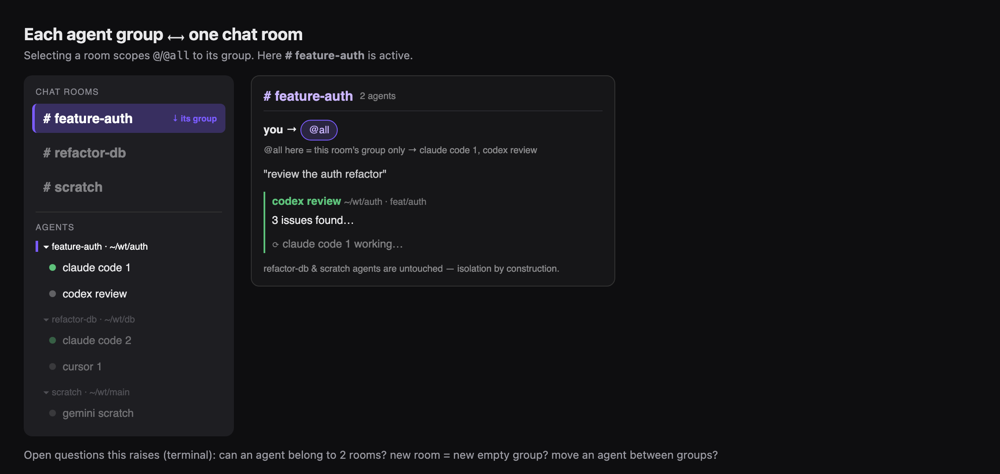
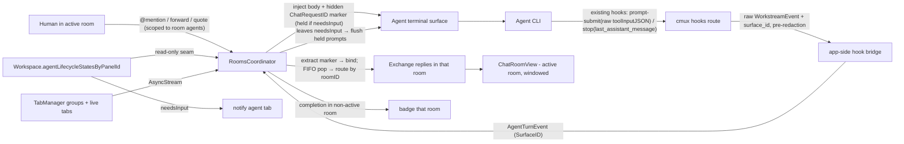

# cmux AI Chat Room — Design & Implementation Plan

> Status: **Draft for review (rev 8)** · Author: Dylan (with Claude) · Date: 2026-06-06
> Review loop: Codex reviews this doc → Claude addresses comments → repeat to convergence → execution.

### Revision history

- **rev 1** — initial spec.
- **rev 2** — incorporates Codex review round 1 (3 independent reviewers, all "Not Ready") after verifying every claim against the code. Major changes: (a) reuse the **existing** cmux agent pipeline — hooks (`CLI/CMUXCLI+AgentHookDefinitions.swift`), launch (`Packages/CMUXAgentLaunch`), lifecycle (`Workspace.agentLifecycleStatesByPanelId`), and the `stop` hook's existing `last_assistant_message` payload — instead of building parallel infrastructure; (b) token-based correlation; (c) fix package layering with a low `CmuxChatRoomCore`; (d) single source of truth for lifecycle; (e) central `WorkspaceRole`-aware close policy; (f) explicit persistence/migration; (g) correct CI test gating; (h) "Step 0" infra audit; (i) UX: richer `@`-autocomplete rows, full (non-collapsed) messages, channel windowing + "load earlier", new-agent failure states, accessibility/reduced-motion.
- **rev 3** — incorporates Codex review round 2 (3 reviewers), verified against code. Major changes: (a) **`surface_id` carried end-to-end** — `WorkstreamEvent`/feed schema extended with `surface_id` (hook layer already has it; `CLI/cmux.swift:205`), and the chat bridge consumes **raw decoded events before EventBus redaction** (`CmuxEventPublishing.swift:451` nulls `tool_input`); per-surface FIFO now works with multiple agent panels per workspace. (b) **Hidden `ChatRequestID` marker** correlation (chosen over exact-text): a non-displayed token is injected with the prompt, round-trips via the raw `toolInputJSON` (`WorkstreamEvent.swift:17`, **not** the whitespace-collapsing `submittedPromptMessage` at `WorkspacePromptSubmit.swift:133`), binds the turn, and is stripped before channel display/forward; FIFO still pairs the bound `prompt-submit` to its `stop`. (c) **Close gate at the lowest mutator** — guard inside `TabManager.closeWorkspace` (`:5205`, which today has only a `guard tabs.count > 1`, no role/can-close guard) with an explicit internal force flag, since AppleScript (`AppleScriptSupport.swift:473`) and config (`CmuxConfigExecutor.swift:508`) call it directly. (d) **needs-input hold** — `send_text` injects raw terminal bytes (`TerminalController.swift:8653`), so prompts to a `needsInput` target are held (not blind-injected into a permission prompt) and delivered when it leaves `needsInput`; running/idle still pipe through immediately. (e) UX: per-message **copy** + **quote-into-composer**.
- **rev 8** — incorporates Codex review round 4 (4 reviewers, all flagging the same blocker), verified against code. **Architecture correction: rooms no longer reuse `WorkspaceGroup`.** Verified that `WorkspaceGroup` is anchor-based (mandatory `anchorWorkspaceId`, created fresh, rendered as header, contiguous runs, dissolves on anchor close, optional `groupId` with many ungroup paths) — incompatible with empty rooms, the two-section layout, and "no ungrouped agents." New model: **a room is a `.chatRoom` workspace; membership is an explicit `roomID` on each agent workspace** (no group binding; `ChatRoomID` == the room workspace id; the old `groupId`/`ChatRoomID` contradiction is gone). The two-section sidebar is a **new section-aware renderer** (rooms top, agents grouped by `roomID` bottom) — net-new work, not reuse. Other fixes: marker round-trip is a **hard per-agent support gate** (degraded FIFO fallback removed — unsupported agents are excluded from `@`, not leaked); **central workspace-creation policy** (every agent workspace gets role+kind+roomID; audit `addWorkspace` paths); **dedicated `closeRoom` flow** (not `deleteWorkspaceGroup`), close = **archive** (history retained by `ChatRoomID`, no reopen UI in v1); worktree cleanup is **two-phase async** off the `@MainActor` close mutator; **"unpushed" detection is net-new CmuxGit plumbing** (`rev-list --count @{u}..HEAD`) — prereq or v1 scopes to dirty-only-with-warning; worktree refcount restored from a **persisted per-tab `cmuxCreatedWorktreeID`**, never live cwd (OSC-7-mutable); move-agent-mid-flight rule (in-flight stays bound to originating room); roster rule (only `.agent`+supported+chat-supported); snapshot-boundary applies to the new room rows; isolation reworded to **mention-scope** (rev-7 rooms can span worktrees).
- **rev 7** — **usage-fit clarifications (Dylan).** (a) A room's membership is **arbitrary** — the common case is room ≈ one worktree, but a room may hold agents from **different branches, worktrees, or even repos** (e.g. a large-scale cross-repo migration room). A group is a user-chosen set of agents; each agent tab carries its own pwd/branch; a room can mix them. The room↔group 1:1 binding is unchanged — only the assumption "group = a single worktree" is dropped. (b) A worktree may be **shared by multiple agent tabs** (e.g. Claude + Codex on the same feature branch), so close-time worktree removal is **refcounted** — remove a cmux-created worktree only when the *last* tab using it closes (fixes a rev-6 bug). (c) Expected pattern: each repo's primary checkout stays on `main`; feature work happens in worktrees.
- **rev 6** — **worktree cleanup on close (Dylan).** An agent tab that cmux launched in a **cmux-created worktree** removes that worktree when the tab closes (`git worktree remove`); a tab launched in an **existing pwd/branch** closes without touching the filesystem. Closing a chat room cascades to its agent group, applying this per tab. Safety: removal is guarded against **uncommitted/unpushed** state (confirm + offer to keep), never a silent nuke. The "owns a cmux-created worktree" flag (+ path/branch) is persisted so cleanup survives restart.
- **rev 5** — **structural pivot (Dylan): multiple chat rooms in one window**, replacing the single pinned chat room. Sidebar splits into two sections — **top: chat rooms** (multiple, renameable), **bottom: agent tabs grouped by `WorkspaceGroup`**. Each chat room corresponds **1:1 to an agent group** (`groupId`); `@`/`@all` scope to *that room's group* (worktree isolation by construction). Motivation: Dylan currently uses one macOS desktop per worktree and switches between them — this collapses that into one cmux instance. Reuses the **existing** cmux group system (`WorkspaceGroup`, `TabManager.swift:1006`; `Workspace.groupId:10300`; group `+`/rename/placement). Consequences: chat rooms are now normal creatable/renameable/closable entities (keep ≥1); **history keys off `ChatRoomID`** (the old "window/session id" open item is resolved); `@all` and isolation are now per-room.
- **rev 4** — incorporates Codex review round 3, verified against code. (B1) confirmed the marker decision is already fully propagated in rev 3 (no exact-text remains); tightened the §4.6 fallback wording. (B2) **final-message capture is confirmed only for Claude via the OMP wrapper** (`CMUXCLI+OmpExtension.swift:192`); there is **no `claude` entry** and codex/cursor `stop` carrying the message is **unconfirmed** — promoted to a named **go/no-go gate (G1)** in Step 0, sized the transcript fallback, and documented that Claude/OMP (self-managed extension, `events: []`) and codex/cursor (`AgentHookDef` table) use **two different hook-install mechanisms**. (B3) added an **identifier-mapping table** — the lifecycle store is `panelId → agentName → state` and a panel may host multiple agents; specified the `(panelId, agentName) → AgentID/SurfaceID` mapping and the one-agent-per-tab constraint. (B4) §4.10 now commits to auditing **every** direct `closeWorkspace` caller (TabManager `4430/5337/5343/5498/5744/6040/7812/7816`, TerminalController `1450/4426/6810/18104`) with force/non-force labels and addresses the `tabs.count > 1` ↔ non-closable-chat-room interaction. Minor: `AgentKind` gains an explicit unsupported-agent path; history-key is a Step-0 must-resolve, not a baked assumption.

---

## 1. Background

### Why this exists

Dylan runs a disciplined multi-agent coding workflow:

```
create-plan → plan-review → plan-execution → code-review
```

with two cooperating roles:

- **Coder agent:** create-plan → address-review-comment → plan-execution → address-review-comment
- **Review agent:** review-plan → code-review

In practice Dylan often pairs **Claude Code as the coder** and **Codex as the reviewer**, because the models have complementary strengths (below). Today this is done by hand — copying text between separate terminal windows — which is tedious and loses track once more than two agents are involved.

### The hard-won philosophy behind the workflow

These beliefs are *requirements in disguise*; the product must protect them:

1. **Review is additive only when a human coordinates toward convergence.** A fully automated Codex⇄Claude `while` loop burned ~60% of a weekly token allowance, executed a plan that was bad from the start, drifted in scope hop-to-hop, and produced something that didn't work. Lesson: **the human holds the canonical intent and gates every hop.** Deliberate friction is a feature — anywhere the tool is tempted to auto-advance a hop, the answer is *no*.
2. **An agent should never be both coder and reviewer in one session.** Authors are biased toward "ship it"; reviewing must be a separate session/agent.
3. **Different models have different shapes.** Codex analyzes better than it codes (it will say "this plan is beyond saving" — the sane, scope-saving call). Claude codes well but is eager-to-please ("is it better now?") and shallower in analysis. Route work to the model whose shape fits.
4. **Agency on both sides is additive** — a coder that can reject a reviewer's claim, a reviewer that can say "not addressed, no-go" — *when a human arbitrates.*
5. **Independent convergence is signal.** Spawn N agents on the same question; if they *independently* converge, that's the obvious answer. Independence is what makes it meaningful — agents must be **blind to each other.**

### What we're building

A fork of **cmux** (native macOS terminal app with vertical tabs) turned into an **AI chat room**: a Slack-like sidebar with **multiple chat rooms** (top section) over **grouped agent terminal tabs** (bottom section). Each chat room corresponds 1:1 to an agent group; you `@mention` agents to send prompts, each agent's *final* message returns to its room, and you forward messages between agents — while every agent tab remains a fully interactive coding-agent terminal.

Multiple rooms in one window replace Dylan's current habit of **one macOS desktop per worktree** (constant Spaces-switching, or one cmux instance per worktree). Now a single instance holds a room per worktree/feature, and `@all` stays scoped to that room's agents — so parallel worktrees don't interfere.

The chat room is an **adjudication and coordination surface** — not a consensus engine, not a wrapper that hides the real sessions. It makes coordination fast and legible; it never removes the human from the loop.

---

## 2. References

### Upstream / fork

- Upstream cmux: https://github.com/manaflow-ai/cmux
- This fork: https://github.com/asura1234/cmux_chat_room
- Binding rules (read first): [`CLAUDE.md`](../../../CLAUDE.md) — package architecture, Swift 6 concurrency, file organization, localization, test wiring, socket policies.

### Existing infrastructure we BUILD ON (verified — the feature is mostly orchestration over these)

| Concern | File · symbol | Notes |
|---|---|---|
| Tab **is** a Workspace | `Sources/TabManager.swift:16` | `typealias Tab = Workspace` |
| Tab presentation fields | `Sources/Workspace.swift:10293-10301` | `customTitle`, `customDescription`, `isPinned`, `customColor`, `groupId` exist |
| Sidebar tab row | `Sources/ContentView.swift:15048` | `TabItemView` (Equatable, snapshot-fed) |
| **Existing sidebar groups (NOT reused for rooms)** | `Sources/TabManager.swift:1006` (`WorkspaceGroup`, mandatory `anchorWorkspaceId`); `Sources/Workspace.swift:10300` (`groupId: UUID?`) | anchor-based, contiguous, can't be empty, dissolves on anchor close; **incompatible with the room model** — rooms use an explicit `roomID` on agent workspaces instead (§4.3/§4.8). Flat renderer: `Sources/SidebarWorkspaceRenderItem.swift:17` |
| Generic workspace creation | `Sources/TabManager.swift:2605` (`addWorkspace`), `:4414` (`deleteWorkspaceGroup` closes members) | many entrypoints create plain terminal workspaces — need a central creation policy (§4.9) |
| Git metadata (dirty only) | `Packages/CmuxGit/Sources/CmuxGit/GitMetadataService.swift:57` (`isDirty`) | **no ahead/behind/upstream** — "unpushed" detection is net-new (§4.10) |
| cwd is mutable | `Sources/Workspace.swift:12205` (`updatePanelDirectory`, OSC-7-driven) | do NOT key the worktree refcount off live `currentDirectory` (§4.11) |
| **Existing agent lifecycle** | `Sources/Workspace.swift:10559` | `agentLifecycleStatesByPanelId: [UUID:[String:AgentHibernationLifecycleState]]` |
| Lifecycle states | `Sources/AgentHibernation/AgentHibernationLifecycleState.swift:3` | `unknown / running / idle / needsInput` |
| Lifecycle mutation + CLI | `Sources/Workspace.swift:12287`; `Sources/TerminalController.swift:19378` | `setAgentLifecycle(...)`, `set_agent_lifecycle` CLI |
| **Existing agent hook defs** | `CLI/CMUXCLI+AgentHookDefinitions.swift:142-256` | table-based hooks for codex/cursor/gemini/grok/kiro/… ; events `prompt-submit`, `stop`, `agent-response`, `session-end/-finalize`. **No `claude` entry** — Claude runs via the OMP wrapper (self-managed extension; `events: []` in the table) |
| **Final-message payload (Claude/OMP only)** | `CLI/CMUXCLI+OmpExtension.swift:192` | `sendHook("stop", ctx, { last_assistant_message })` — verified for OMP/Claude only; **codex/cursor `stop` carrying the final text is unconfirmed (gate G1, §5)** |
| Hook → app routing | `cmux hooks <agent> <subcommand>` over `CMUX_SOCKET_PATH`; `Sources/WorkspacePromptSubmit.swift:86` (`lastAssistantMessage`); `CLI/FeedEventClassifier.swift:214` (`stop → .response`) | the feed already classifies turn-completion |
| **Agent launch infra** | `Packages/CMUXAgentLaunch/` (`HermesAgentHookConfig.swift`, `AgentSpawnIdentity.swift`, env policy, resume) | hook install + identity stamping; reuse for launch |
| Panel protocol (needs shim) | `Sources/Panels/Panel.swift:267` | `protocol Panel: AnyObject, Identifiable, ObservableObject` — **requires ObservableObject** |
| New terminal surface | `Sources/Workspace.swift:14522` | `newTerminalSurface(...)` |
| Inject text | `Sources/TerminalController.swift:18155,18290`; V2 `surface.send_text` `:2010` | prompt injection path |
| Close paths (scattered) | `Sources/TabManager.swift:5381,5402,5412,5423`; socket `closeWorkspace` `Sources/TerminalController.swift:18104`; UI `Sources/ContentView.swift:15482` | `canCloseWorkspace(_,allowPinned:)` gates on `isPinned`; **no role-aware single gate** |
| Persistence snapshots | `Sources/SessionPersistence.swift:1379` (`SessionTerminalPanelSnapshot`, has `agent`), `:1787` (`SessionWorkspaceSnapshot`, has `isPinned/groupId/customColor`) | **no agent-kind / workspace-role field yet** |
| Notifications hub | `Sources/TerminalNotificationStore.swift:822` | split notifications |
| Rename plumbing | `Sources/ContentView.swift:3138-3157`; `Sources/Workspace.swift:12076-12132` | command-palette + context-menu → `customTitle` |
| Package wiring exemplars | `Packages/CmuxSettings`(+UI), `Packages/CmuxSocketControl`, `Packages/CMUXAgentLaunch` | copy pbxproj shape |
| **CI package-test gate** | `.github/workflows/ci.yml:411-442` | `cmux-unit` does NOT run SPM tests; a `PACKAGES=(…)` list runs `swift test --package-path` per package — new packages MUST be added here |
| Localized strings | `Resources/Localizable.xcstrings`; `web/messages/{en,ja}.json` | EN + JA |

---

## 3. Product / UX design

> Mockups are the brainstorm artifacts rendered to PNG. Interactive HTML originals live under `.superpowers/brainstorm/` (gitignored). Note: mockups predate two later decisions — `~`-abbreviated paths, and richer `@`-autocomplete rows (§3.10).

### 3.1 Two-section sidebar: chat rooms over their agents
The sidebar has two sections (a **new section-aware renderer**, not the existing flat/`WorkspaceGroup` one):
- **Top — Chat rooms:** N rooms (each colored, renameable). Selecting one makes it **active** (its channel shows in the content area). Creatable/closable; keep ≥1.
- **Bottom — Agents:** agent tabs grouped under their room. Membership is an explicit **`roomID` on each agent** (not `WorkspaceGroup`). The **agent tab is the only non-chat-room tab type** — no plain bash tabs; run shell via the agent's `!`. A tab "launched in an existing directory" is still an agent tab, just not in a cmux-created worktree.

**Room ⟷ membership (the core structure):** selecting a room scopes everything to its agents. `@` autocomplete and `@all` resolve to **that room's agents only** (agents whose `roomID` == the active room); other rooms' agents are unreachable from here. So **mention-scoping is structural** — `@all` never crosses rooms. (Note: a room may *contain* agents from different worktrees/repos (rev 7), so this is **mention-scope isolation**, not "worktree isolation" — the latter is only the common case.)

- **Membership:** an agent belongs to **exactly one** room (`roomID`, non-optional). No "ungrouped" agents — see the creation policy (§4.9) and the disabling of existing ungroup paths (§4.8). A room's agents may be **heterogeneous** (different branches/worktrees/repos — e.g. a cross-repo migration room).
- **Creation:** a new room is created empty (trivially — it's just a room entity with no agents yet). Creating an agent (kind + worktree, §4.9) assigns it the **active room's `roomID`**.
- **Moving:** drag an agent between rooms to reassign its `roomID` (in-flight turns stay bound to the originating room, §4.6).



*(Selecting `#feature-auth` shows its agents and scopes `@all` to them; `refactor-db`/`scratch` agents are untouched. The mockup labels groups by worktree for the common case; membership is by `roomID`, not worktree. Earlier single-room mockups under `assets/` predate the multi-room pivot.)*

### 3.2 Sidebar — agent tabs (three lines + live status)
Editable title (auto-named "claude code 1"), then **~pwd**, then **branch on its own line**. Live lifecycle badge from the **existing** `agentLifecycleStatesByPanelId`: rotating green spinner = `running`, dim dot = `idle`, pulsing amber + `!` = `needsInput`.


### 3.3 Rename = title only
Double-click the title text → inline edit (pre-selected; Enter saves / Esc cancels). Same action via right-click → Rename and command palette → Rename Tab. pwd/branch read-only.


### 3.4 Routing rule — chat-origin replies only
An agent's final message returns to **its room's channel** **only** if the prompt came from that room. Direct turns stay in the tab. Guaranteed by token correlation (§4.6), not heuristics.


### 3.5 Channel layout — grouped exchanges (one level deep)
Ordered list of **exchanges**: one outgoing prompt (`@mention` or forward) + the replies from its targets, grouped beneath. A forward is a *new* exchange — not a nested thread.


### 3.6 Exchange progress + stalled visibility
Each exchange shows **N/M replied**, who's still `running`, and any `needsInput` agent (amber, jump-to-tab). Status is read from the existing lifecycle state.


### 3.7 Message labeling + forward / quote
Every reply is stamped with the origin agent's name + two subtitles, **snapshotted at send time**. Each message carries three actions:
- **Forward** — wraps the original in `"double quotes"` and lets you **append your own note**, then *sends it to one or more agents* — the *steering wheel* (re-scope, narrow, reject a claim).
- **Quote into composer** — same quote shape, but drops the `"double-quoted"` original into *your own composer* so you can add text after it and post it as **your** channel message (not sent to an agent). This is the human analog of forward, for composing structured messages like a quote-plus-reply.
- **Copy** — copies the message's raw text to the clipboard.


### 3.8 Full messages, no collapsing
Channel messages and the forward/quote preview **always render in full** — no "read more" / truncation / collapse of any kind (a collapse invites skimming). Non-hiding affordances only: **copy**, **quote into composer** (§3.7), and a **go-to-source-tab** link per message.

### 3.9 Channel windowing ("load earlier")
For very long histories the channel keeps a **bounded recent window** scrollable (e.g. the most recent N exchanges). Scrolling to the top reveals a **"Load earlier"** button that pages older exchanges in from the persisted store on demand. Individual messages are never truncated; only the *count* of rendered exchanges is bounded for performance.

### 3.10 Mention targeting
You type/match the **name** (`@`), but each autocomplete **dropdown row shows name + kind + ~cwd + branch** so duplicate/renamed titles and "same repo, different branch" are distinguishable. Selection stores a **stable `AgentID`**, never the display string. The dropdown is **rebuilt fresh each time it opens** and is **scoped to the active room** — only that room's live agents appear; `@all` = that set. (Agents in other rooms are deliberately unreachable from here — mention-scope isolation.)

### 3.11 Sending vs. agent state
Prompts inject **raw terminal input** (not a semantic queue), so state matters:
- **running / idle** → injected immediately (these TUIs buffer follow-up input safely).
- **needs-input** (agent sitting at a permission/y-n prompt) → **held, not injected** (a blind injection could answer the dialog with garbage). The exchange shows that target as *"waiting — agent needs input"* with a jump-to-tab link; the held prompt is delivered automatically once the agent leaves `needsInput`. If the agent never leaves it (or the tab closes), the held prompt resolves to `failedToDispatch` / `tabClosed`.

### 3.12 Notifications (v1)
Disjoint events, no double-ring:
- **Completion** (chat-origin turn finished) → notifies **its chat room** (badge on that room in the top section) when that room isn't the active/focused one.
- **Needs-input** (agent blocked) → notifies the **agent tab**.

### 3.13 Accessibility
Status is never color/motion-only: each lifecycle state carries a **text/accessibility label** (`running` / `idle` / `needs input`). Honor **Reduce Motion** (spinner → static glyph) and high-contrast.

### 3.14 Explicit non-goals for v1 (YAGNI)
No `/poll` or slash-command framework; no automated review/apply loop; no interrupt-from-chat; no token/cost accounting (strong follow-on); no deep/nested threads; no general busy-queue — the only state-based hold is the `needsInput` safety hold (§3.11).

---

## 4. Engineering design

### 4.1 Constraints (from `CLAUDE.md`, binding)
Layered package DAG (Core → Services → Domain → UI → Executable), downward deps only. Swift 6 concurrency only (`actor`/`async`/`AsyncStream`/`@Observable`/`@MainActor`; no Combine/`@Published`/locks/`DispatchQueue.main.async`/completion handlers). Constructor DI; the executable is the single composition root. One type per file; DocC on public symbols. Snapshot boundary (rows get value snapshots + closures, never a store). No state mutation in view-body. Inject `UserDefaults`/`FileManager`/paths/clock. Swift Testing. Localization audit. Socket: no focus stealing; telemetry off-main.

### 4.2 Packages (layering fixed)

```
Packages/
  CmuxChatRoomCore/    # Core: pure Sendable DTOs, IDs, AgentEvent, protocol seams (no AppKit)
  CmuxChatRoom/        # Domain/State: @Observable coordinator + correlation (depends ↓ Core)
  CmuxChatRoomUI/      # UI: SwiftUI channel views (depends ↓ CmuxChatRoom + Core)
  CMUXAgentLaunch/     # (existing Service) extended for chat-room agent launch + hook install
```

Dependency direction is strictly downward: `CmuxChatRoomUI → CmuxChatRoom → CmuxChatRoomCore`; agent launch lives in the existing **services** package `CMUXAgentLaunch` (also `→ Core` only). The app target composes concretes. This resolves the rev-1 inversion (services no longer import the domain package).

### 4.3 Data model (`CmuxChatRoomCore`, all `Sendable` value types)

```swift
public struct AgentID: Hashable, Sendable, Codable { public let raw: UUID }      // = agent workspace/tab id
public struct SurfaceID: Hashable, Sendable, Codable { public let raw: UUID }    // agent's terminal surface
public struct ChatRoomID: Hashable, Sendable, Codable { public let raw: UUID }   // == the room workspace's id
public struct ChatRequestID: Hashable, Sendable, Codable { public let raw: UUID } // correlation token
public struct MessageID: Hashable, Sendable, Codable { public let raw: UUID }
public struct ExchangeID: Hashable, Sendable, Codable { public let raw: UUID }

/// A chat room: a named channel. Backed by a `.chatRoom` workspace (its `id` == that workspace's id).
/// Membership is NOT a WorkspaceGroup — it's the set of agent workspaces whose `roomID == this.id`.
public struct ChatRoom: Sendable, Codable, Identifiable {
    public let id: ChatRoomID        // == the backing .chatRoom workspace id
    public var name: String          // renameable
}

public enum AgentKind: String, Sendable, Codable { case claudeCode, codex, cursor }
// v1 supports exactly these three. The lifecycle store admits ~16 agent-name strings and the hook
// table has more (grok/gemini/kiro/…). Roster derivation maps an unknown agent name to `nil` kind →
// the tab is treated as "unsupported": not @-mentionable, no crash (see §4.3 identifier mapping).

public struct AgentIdentitySnapshot: Sendable, Codable, Hashable {
    public let agentID: AgentID
    public let title: String           // editable title at send time
    public let kind: AgentKind
    public let cwdDisplay: String      // ~-abbreviated
    public let branch: String?
}

public enum PromptOrigin: Sendable, Codable, Equatable {
    case userMention
    case forward(sourceMessageID: MessageID)
}

public struct OutgoingPrompt: Sendable, Codable {
    public let exchangeID: ExchangeID
    public let roomID: ChatRoomID      // which room this exchange lives in
    public let origin: PromptOrigin
    public let bodyText: String        // forward: "\"<quoted>\"\n<note>"
    public let targets: [AgentIdentitySnapshot]   // resolved from this room's agents only
    public let sentAt: Date
}

public struct Reply: Sendable, Codable {
    public let id: MessageID
    public let exchangeID: ExchangeID
    public let from: AgentIdentitySnapshot
    public let markdownBody: String    // verbatim last_assistant_message
    public let receivedAt: Date
}

public enum ReplyOutcome: Sendable, Codable {
    case pending, replied(Reply), tabClosed, failedToDispatch
}

public struct Exchange: Sendable, Codable {
    public let prompt: OutgoingPrompt
    public var outcomes: [AgentID: ReplyOutcome]
}

/// Normalized turn events the coordinator consumes (sourced from existing hooks).
/// Carry `SurfaceID` (not just workspace) so per-surface FIFO works with multiple agent panels.
public enum AgentTurnEvent: Sendable {
    /// `rawPromptText` is the UN-normalized prompt from `toolInputJSON` (NOT the whitespace-collapsed
    /// `submittedPromptMessage`), so the embedded marker survives and is extractable.
    case promptSubmitted(SurfaceID, rawPromptText: String)
    case turnCompleted(SurfaceID, finalMessage: String)   // from `stop` last_assistant_message
}

/// The hidden correlation marker embedded in an injected prompt and recovered from `rawPromptText`.
/// Rendered invisibly (see ``ChatPromptMarker/inject`` / ``strip``); never shown in the channel or a forward.
public enum ChatPromptMarker {
    /// Append a non-displayed token encoding `id` to `body` before injection.
    public static func inject(_ id: ChatRequestID, into body: String) -> String { … }
    /// Recover the `ChatRequestID` (if any) from a raw prompt, plus the body with the marker removed.
    public static func extract(from rawPrompt: String) -> (ChatRequestID?, cleaned: String) { … }
}
```

**Identifier spaces.** These must not be conflated:

| Coordinate | Type | Meaning | Owner |
|---|---|---|---|
| `ChatRoomID` | `UUID` | a chat room; **== the backing `.chatRoom` workspace id** | `RoomsCoordinator` (§4.6) + `TabManager` |
| `AgentID` | `UUID` | the agent **tab/workspace** id | `TabManager` |
| `roomID` | `ChatRoomID` | **non-optional** on each `.agent` workspace — its room membership | `Workspace` (new field) |
| `SurfaceID` | `UUID` | the agent's **terminal surface** (= cmux `panelId`) | `Workspace.panels` |
| `panelId` | `UUID` | key of the existing lifecycle store | `Workspace.agentLifecycleStatesByPanelId` |
| `agentName` | `String` | inner key of the lifecycle store (`"claude_code"`, …); a panel may hold several | the agent CLI / hook |

**Room ↔ membership:** a room's agents = live `.agent` workspaces with `roomID == room.id`. **No `WorkspaceGroup`, no separate `groupId`** — this removes the rev-7 `ChatRoomID`/`groupId` contradiction. The `.chatRoom` workspace's id *is* the `ChatRoomID`.
**v1 constraints:** one agent per agent-tab (so `SurfaceID == panelId`; lifecycle lookup `agentLifecycleStatesByPanelId[panelId][agentName]`), and one agent → one room (`roomID` non-optional). The `AgentRosterProviding`/`AgentLifecycleReading` seams own the `AgentID ↔ (panelId, agentName)` map; a panel reporting multiple agent names → tab flagged unsupported, not guessed.

### 4.4 Reuse the existing hook pipeline (no new transport)

The agent CLIs already run cmux hooks (`CLI/CMUXCLI+AgentHookDefinitions.swift`) that call `cmux hooks <agent> <subcommand>` over the socket. We **extend the app-side handling** of two events already in the pipeline rather than writing new hook scripts or a `chat.agent_report` command:

- `prompt-submit` — carries the submitted prompt text.
- `stop` (a.k.a. `agent-response`) — carries `last_assistant_message` **for Claude via the OMP wrapper only** (`CMUXCLI+OmpExtension.swift:192`). **Whether codex/cursor `stop` carries the final message is unconfirmed** (see gate G1).

App-side, these are routed (per surface) into a `CmuxChatRoomCore.AgentTurnEvent` stream the coordinator subscribes to.

**Two hook-install mechanisms, not one (verified).** "Reuse `CMUXAgentLaunch`" is *not* uniform across agents:
- **Claude** runs through the **OMP self-managed extension** — its hook entry has `events: []` in the table and OMP installs/owns its own hooks; this is the only path verified to emit `last_assistant_message`.
- **codex/cursor/etc.** use the **`AgentHookDef` table** (`prompt-submit`/`stop`/…). Their final-message payload is unverified.
So the chat bridge must handle both install/report shapes; the spec no longer assumes a single symmetric "claude/codex/cursor hook."

**Gate G1 (go/no-go, in Step 0): can the *reviewer* return its text?** The product has no value until Codex (the reviewer half of the core use case) can post its final message to the channel. Step 0 must confirm, per codex and cursor, that *either* `stop` carries the final message *or* it is recoverable from the transcript (`RestorableAgentSession.transcriptPath`, §7). **Size the transcript fallback now** — it is a materially larger lift than an adapter (locate + tail the per-agent transcript, parse the last assistant turn, map session→surface), and if needed it moves out of "Step 0 finding" into its own implementation step before that agent ships. If neither path works for an agent, that agent is **not in v1** (explicit, not silent).

**Step 0 also confirms**, per agent, that `prompt-submit` fires for *injected* input and that the marker (§4.6) round-trips through that agent's prompt handling without the agent choking on it.

**Two schema/plumbing fixes required (verified gaps):**
- **`surface_id` must be carried end-to-end.** `WorkstreamEvent` currently has `workspaceId` but no `surfaceId` (`WorkstreamEvent.swift:14`); the hook layer already knows the surface (`CLI/cmux.swift:205`), so extend the `feed.push`/`WorkstreamEvent` schema with `surface_id` and thread it through. Without it, per-surface FIFO collapses when a workspace holds multiple agent panels.
- **Consume RAW events before redaction.** The public `EventBus` nulls `tool_input`/`context` bodies (`CmuxEventPublishing.swift:451`). The chat bridge must tap the **raw decoded `WorkstreamEvent`** (`toolInputJSON`/`extraFieldsJSON`, `WorkstreamEvent.swift:17,22`) *before* that redaction — both to read the prompt and to recover the marker. It must **not** use `submittedPromptMessage`, which collapses whitespace (`WorkspacePromptSubmit.swift:133`) and would corrupt multiline prompts/forwards.

`AgentRosterProviding` (live tabs → mentionable set) and `PromptInjecting` (wrap `surface.send_text` + submit, non-focus-stealing) are protocol seams in `CmuxChatRoomCore`, implemented in the app target over `TabManager` / `TerminalController`.

### 4.5 Lifecycle: single source of truth

The coordinator does **not** keep its own lifecycle dictionary. Sidebar badges, exchange progress, and the needs-input notification all read the **existing** `Workspace.agentLifecycleStatesByPanelId` (already updated by `set_agent_lifecycle`). The coordinator observes it via a read-only seam (`AgentLifecycleReading`, exposing a snapshot + `AsyncStream` of changes keyed by `AgentID`) implemented in the app over the existing store. No drift with hibernation/sidebar.

The seam performs the identifier mapping from §4.3: for an agent tab it resolves `AgentID → (panelId, agentName)` and reads `agentLifecycleStatesByPanelId[panelId][agentName]`. It is the **only** place that crosses between the chat-room id space (`AgentID`/`SurfaceID`) and the store's `(panelId, agentName)` space; the coordinator never sees `panelId`/`agentName`.

### 4.6 Coordinator + marker correlation + needs-input hold (`CmuxChatRoom`, `@MainActor @Observable`)

```swift
/// Owns all chat rooms; correlation queues are global (a surface belongs to one agent in one room).
@MainActor @Observable
public final class RoomsCoordinator {
    public private(set) var rooms: [ChatRoom] = []
    public private(set) var activeRoom: ChatRoomID?
    private var byRoom: [ChatRoomID: RoomChannel] = [:]            // per-room channel state

    // global correlation (keyed by surface / request, not by room)
    private var turnQueueBySurface: [SurfaceID: [TurnBinding]] = [:]
    private var pendingByRequest: [ChatRequestID: PendingInjection] = [:]
    private var heldForNeedsInput: [AgentID: [HeldPrompt]] = [:]   // §3.11 safety hold

    private let roster: any AgentRosterProviding   // resolves a room → its live agents (by roomID)
    private let lifecycle: any AgentLifecycleReading
    private let injector: any PromptInjecting
    private let notifier: any ChatNotifying
    private let history: any ChatHistoryStore

    public func createRoom(name: String) async -> ChatRoomID { … }   // also creates the bound WorkspaceGroup
    public func renameRoom(_ id: ChatRoomID, to: String) async { … }
    public func closeRoom(_ id: ChatRoomID) async { … }              // §4.10; keep ≥1
    public func send(in room: ChatRoomID, _ body: String, to mentions: [AgentMention], origin: PromptOrigin) async { … }
    public func forward(_ message: MessageID, to: [AgentMention], note: String) async { … }
    public func handle(_ event: AgentTurnEvent) { … }               // routes via request→room map
    public func onLifecycleChange(_ id: AgentID, _ state: AgentLifecycle) { … }
    public func loadEarlier(in room: ChatRoomID) async { … }
}

/// One room's view state (bounded window in UI; full set in the store).
struct RoomChannel { var roomID: ChatRoomID; var exchanges: [Exchange] }

struct PendingInjection { let requestID: ChatRequestID; let exchangeID: ExchangeID; let roomID: ChatRoomID; let surface: SurfaceID }
struct HeldPrompt { let requestID: ChatRequestID; let exchangeID: ExchangeID; let roomID: ChatRoomID; let bodyWithMarker: String }
enum TurnBinding { case chatOrigin(ChatRequestID, ExchangeID, ChatRoomID); case direct }
```

**Correlation invariant (the core of the routing rule) — marker-based, room-scoped:**

1. `send(in: room, …)`: resolve mentions **against `room`'s agents only** (role `.agent` + `roomID==room` + chat-supported) → live `AgentID`/`SurfaceID` at send time (mentions outside the room are not offered; dead → `.failedToDispatch`). Create one `Exchange` with `roomID = room`. For each target: mint a `ChatRequestID` (recorded with its `roomID`), build `bodyWithMarker = ChatPromptMarker.inject(id, into: body)`, mark outcome `.pending`. **If the target is `needsInput`**, hold (§3.11); **otherwise** record `pendingByRequest[id]` and inject `bodyWithMarker`. Persist to that room's history.
2. `handle(.promptSubmitted(surface, rawPromptText))`: `let (id, _) = ChatPromptMarker.extract(from: rawPromptText)`. If `id` is present **and** in `pendingByRequest` → remove it, append `.chatOrigin(id, exchangeID, roomID)` to `turnQueueBySurface[surface]`. Else append `.direct`. (Binding requires the marker — a direct turn, even byte-identical, has no marker and is never chat-origin.)
3. `handle(.turnCompleted(surface, finalMessage))`: pop the **front** of `turnQueueBySurface[surface]` (agents process turns in order). `.chatOrigin` → attach `finalMessage` to that exchange/target **in its `roomID`'s channel**, persist, notify that room (if it isn't the active/focused room). `.direct` → **drop**.
4. `onLifecycleChange(agent, state)`: when an agent leaves `needsInput`, flush `heldForNeedsInput[agent]` — for each held prompt, record `pendingByRequest` and inject `bodyWithMarker`.
5. Tab closed: `.pending`/held outcomes for that agent → `.tabClosed`; clear its queues/holds.
6. **Agent moved to another room** (`roomID` change): in-flight `pending`/`held`/queued turns **stay bound to their originating room** (each binding already carries its `roomID`/`exchangeID`), so a reply in flight still lands in the room it was sent from. Only *future* `@`-sends use the new room. Moving an agent never reroutes or drops in-flight chat work.

The marker makes binding independent of prompt text, so a byte-identical direct prompt while a chat prompt is pending can no longer mis-bind (it carries no marker). A direct turn that completes first is bound `.direct` and dropped. No marker ⇒ no chat binding ⇒ no leak.

> **The marker is the only correlation mechanism, and a hard per-agent support gate.** There is no exact-text path (exact-text is broken anyway — `submittedPromptMessage` collapses whitespace, `WorkspacePromptSubmit.swift:133`) and **no degraded FIFO fallback** (it would reopen the byte-identical-direct-prompt leak the routing rule rejects). **Marker constraints** (encoding fixed in Step 0): the token must (a) survive verbatim in `toolInputJSON`, (b) strip reliably before any channel display/forward, (c) not derail the agent. Candidate: a single trailing line treated as inert metadata. **An agent for which the marker cannot round-trip (or whose final message can't be captured, G1) is "not chat-supported": it is excluded from `@`/`@all`** (you can still use its tab directly). No agent ships with weaker routing semantics.

### 4.7 Live roster (no parallel registry), per room
`AgentRosterProviding` is implemented over `TabManager`, exposing `current(inRoom:)` + an `AsyncStream` of changes. **Roster rule (explicit):** a room's mentionable set = live workspaces where `role == .agent` **and** `roomID == room.id` **and** the agent is **chat-supported** (supported `AgentKind` whose marker round-trips, §4.6). This excludes the `.chatRoom` workspaces themselves and any unsupported/unknown agent. `@all` = that set at send instant. The dropdown calls `current(inRoom:)` for the active room on open (§3.10). No parallel registry — `roomID` membership *is* the source of truth.

### 4.8 Two-section sidebar + rooms (app target — NEW renderer, not `WorkspaceGroup`)
**Rooms are workspaces; membership is `roomID`; `WorkspaceGroup` is not used here.** This sidesteps the anchor/contiguity/empty-group/ungroup constraints that make `WorkspaceGroup` unfit (§2 table).
- **Room = `.chatRoom` workspace.** It lives in `tabs[]` like any workspace (so it reuses tab selection, content-area hosting, and session persistence), carries `WorkspaceRole.chatRoom` and its `ChatRoomID` (== its workspace id), and is **rendered in the top section, never the agent section**. Rooms are creatable / renameable / closable (keep ≥1).
- **Active room = the selected `.chatRoom` workspace.** There is no separate global `activeRoom` flag — selecting the room workspace (existing selection machinery) shows its `ChatRoomView` in the content area and scopes the bottom section. (Resolves the "N panels show the same room?" ambiguity: exactly the selected room's channel is shown.)
- **New section-aware renderer** (`SidebarWorkspaceRenderItem` today emits one flat list): split into top (`.chatRoom`) and bottom (`.agent`, grouped under their `roomID`'s room header). This is **net-new** (section-aware ordering + drag), not reuse of the group renderer.
- **Agent tab:** `WorkspaceRole.agent` + `AgentKind` + non-optional `roomID`; auto-named; three-line layout + lifecycle badge. **Drag between rooms** rewrites `roomID` (§4.6 move rule).
- **Disable the existing ungroup paths for chat-room agents** so an agent can never become room-less: the creation policy (§4.9) always sets `roomID`, and `WorkspaceGroup`-era `groupId = nil` paths (`ungroupWorkspaceGroup`, `dissolveGroupsAnchoredBy`, etc.) don't apply because we don't use groups. Audited in Step 0.
- **Snapshot boundary (CLAUDE.md #2586):** the top-section room rows, per-room unread badges, and active-room highlight are **value snapshots + closures** — the `RoomsCoordinator` is never referenced below the rooms `ForEach` (same rule already applied to agent rows).
- `ChatRoomPanel: Panel` — `Panel` requires `ObservableObject`, so this is a **thin legacy shell** holding the `@Observable` `RoomsCoordinator` and forwarding; intentional adapter until `Panel` is modernized.
- `ChatRoomView` (`CmuxChatRoomUI`): renders the selected room's channel — windowed snapshot-fed exchanges + "Load earlier", room-scoped `@` autocomplete (§3.10), per-message **forward / quote-into-composer / copy / go-to-tab** (§3.7), full messages (§3.8), progress + needs-input/held status, markdown.

### 4.9 Create-agent + worktree sub-flow (with failure states)
**Central creation policy (one path).** All agent-workspace creation goes through a single policy that stamps **`role = .agent`, `AgentKind`, and `roomID` (the active room)** — no workspace is created without them. The generic `addWorkspace` entrypoints (`TabManager.swift:2605`, audited in Step 0) are routed through this policy (or disabled) in chat-room builds, so there are no role-less / room-less / bash workspaces. The `.chatRoom` workspace has its own creation path.

"New agent" sheet: (1) kind; (2) location — *current pwd/branch* or *new worktree* (base branch + new branch + parent dir → `git worktree add <path> -b <branch> <base>`); then launch via `CMUXAgentLaunch`, auto-name, assign the active room's `roomID`.
**Track cmux-created worktrees, refcounted, via a persisted id.** cmux maintains a registry of worktrees it created (keyed by path: branch + referrer set). Each agent tab persists a **`cmuxCreatedWorktreeID`** when launched into one (the *new worktree* path registers it; a later agent launched into the same worktree references the same id). A tab in an **existing, non-cmux-created** directory carries **no** id — never removed. Refcount = number of tabs referencing a worktree id; cleanup at zero (§4.10). The id is the durable link (NOT live cwd, which OSC-7 mutates).
**Failure/validation (inline, recoverable):** path or branch collision; dirty/missing base repo; missing CLI binary; unsupported/uninstalled hook for that agent; `git worktree add` failure; partial launch (surface created but agent didn't start → offer retry/close). Each surfaces an inline error in the sheet; nothing half-creates silently.

### 4.10 Close policy
**Two distinct close flows.** Agent-tab close goes through the low-level mutator; room close is a dedicated higher-level flow (NOT `deleteWorkspaceGroup`, whose anchor-dissolve semantics don't match).

**Low-level gate (agent tabs + the room workspace).** `TabManager.closeWorkspace` (`:5205`, today only `guard tabs.count > 1`) gains a `force: Bool = false` param and a return result (closed/refused); it **refuses closing the last `.chatRoom`** unless `force`. It is **synchronous and runs no git/filesystem** (see two-phase cleanup below). `canCloseWorkspace` stays a UI affordance only. Audit every direct caller as force/non-force:

  | Caller | Path | Default |
  |---|---|---|
  | `TerminalController:18104,1450,4426` | socket | non-force |
  | `TerminalController:6810` | `workspace.unpin.related_workspaces` | non-force |
  | `AppleScriptSupport:473,624` | AppleScript | non-force |
  | `CmuxConfigExecutor:508` | config replace | **force** |
  | `TabManager:5337,5343` | `closeTab` / `closeCurrentWorkspace` | non-force |
  | `TabManager:4430,5498,5744` | (legacy group delete / batch — N/A, rooms don't use groups) | n/a |
  | `TabManager:6040,7812,7816` | internal cleanup / teardown | **force** |

**`closeRoom(id)` flow (dedicated):** enforce keep-≥1-room **before** any mutation; resolve the room's agent members up front (snapshot the set); run the **two-phase worktree cleanup** (below) for those agents; close each agent member; then close the room workspace (`force`). Close-all / window-teardown `force`-closes rooms last. **Close = archive:** the room's history file is retained on disk keyed by `ChatRoomID`; **v1 has no reopen UI** (retained for a future feature — there is *no* "re-openable by id" promise in v1, so nothing dangles). Confirm if any member agent is `running`.

**Two-phase, async worktree cleanup (git off the `@MainActor` mutator).** Removal must never run inside the synchronous close mutator. A `WorktreeService` (`actor`, async) does the git work; close is request→confirm→commit:
1. **Request (off-mutator):** for each closing agent, drop it from its `cmuxCreatedWorktreeID` referrer set; collect worktrees whose refcount hit zero.
2. **Inspect + confirm:** the service checks each zero-refcount worktree for **uncommitted** (`isDirty`, exists in CmuxGit) and **unpushed** (`git rev-list --count @{u}..HEAD` + no-upstream handling — **net-new CmuxGit plumbing**, §2). Dirty/unpushed → **do not remove**, surface state, default *keep*. Clean → confirm (batched into one summary when a whole room closes).
3. **Commit (async):** `git worktree remove` the confirmed-clean worktrees; the tab/room close itself already completed synchronously.
A tab in a **non-cmux-created** directory has no id → close only, **touch no files**. Pending/held outcomes for a closing agent → `.tabClosed`; past messages persist.

> **v1 scope note (gate):** if the `@{u}..HEAD` ahead/behind plumbing slips, v1 cleanup is **dirty-only** with an explicit "unpushed not checked yet" warning in the confirm — never a silent degrade.
  - Closing a **chat room** cascades to its member agents; apply the above per tab, and **batch** the resulting worktree confirmations (one summary listing dirty/unpushed worktrees) rather than N dialogs.

### 4.11 Persistence + migration
`ChatHistoryStore` (actor-backed repository, JSON under Application Support). Stores all exchanges/replies with embedded `AgentIdentitySnapshot`; supports **paged reads** for "Load earlier" (§3.9) and bounded initial load.
**History keys off `ChatRoomID`** — the room is a first-class, persisted entity with its own stable id, so the old "what id survives restore?" problem is gone. Each room's history file is keyed by its `ChatRoomID`.
Session snapshots gain explicit fields (migration defaults for old data):
- **Rooms list** — the `ChatRoom`s (`id`, `name`) + which is selected, persisted with the window/session. (Migration: a pre-rooms session gets one default room; its existing agent tabs are stamped with that room's `id`.)
- `SessionWorkspaceSnapshot.role: WorkspaceRole` (default `.agent`; `.chatRoom` for the room workspace) and, on `.agent`, the **`roomID`** and **`AgentKind`**. (`roomID` replaces any reliance on the existing `groupId`.)
- **Worktree registry** — persisted **top-level on `AppSessionSnapshot`** (`SessionPersistence.swift:1859`), keyed by **path** (branch + the set of referencing tab ids), matching the refcount's path-keyed shape (not duplicated per workspace). Each `.agent` snapshot persists its **`cmuxCreatedWorktreeID`** (or none).
- **Restore the refcount from the persisted ids, NOT live cwd.** `currentDirectory` is OSC-7-mutable (`Workspace.swift:12205`) and unreliable; rebuilding referrer sets from cwd would under/over-count and remove a still-used worktree. Rebuild strictly from each tab's persisted `cmuxCreatedWorktreeID`.
On restore: rebuild rooms from the persisted list; re-derive each room's roster from restored `.agent` workspaces' `roomID`; reconnect each room's history by `ChatRoomID`; rebuild the worktree registry from persisted ids. Without role/kind/roomID, restored agent tabs would lose their room binding and badges — required, not optional.

### 4.12 Data flow



---

## 5. Execution steps

Vertical slice: Claude Code end-to-end *before* Codex/Cursor. Two-commit red/green per regression test.

0. **Existing-infra audit + gates (no code).** Produce a findings note that confirms/adjusts §4.3–§4.11 and resolves these before any code:
   - **Gate G1 (go/no-go): can codex and cursor return their final message?** Confirm `stop` carries it, or that it's recoverable from `RestorableAgentSession.transcriptPath`. **Size the transcript fallback** (locate/tail transcript, parse last assistant turn, map session→surface); if needed it becomes its own step before that agent ships. An agent that can do neither is **out of v1** (explicit).
   - **Marker encoding (hard gate, no fallback)** — fix a concrete token that round-trips through `toolInputJSON` and that Claude/codex/cursor each tolerate (test all three). An agent where it can't round-trip is **not chat-supported** (excluded from `@`), not degraded (§4.6).
   - **`surface_id` threading** — where it's available at the hook layer (`CLI/cmux.swift:205`) and how to add it to `WorkstreamEvent`/`feed.push` without breaking existing consumers.
   - **Identifier mapping** — confirm one-agent-per-tab and `AgentID ↔ (panelId, agentName)`; `roomID` is a new non-optional field on `.agent` workspaces (§4.3).
   - **Design the two-section sidebar split** — `SidebarWorkspaceRenderItem` is flat today; design the section-aware renderer (top `.chatRoom`, bottom `.agent` grouped by `roomID`) + section-aware drag. This is **net-new work**, not group reuse (§4.8).
   - **Workspace-creation policy audit** — enumerate every `addWorkspace`/workspace-creation entrypoint (`TabManager.swift:2605`, …); route all through the policy that stamps role+kind+roomID, or disable in chat-room mode (§4.9).
   - **`git` ahead/behind plumbing** — size `rev-list --count @{u}..HEAD` (+ no-upstream) in CmuxGit (net-new); decide prereq-step vs v1 dirty-only-with-warning (§4.10).
   - **Close-caller audit** — re-grep every direct `closeWorkspace` caller; label force/non-force; confirm `closeRoom` is a dedicated flow (NOT `deleteWorkspaceGroup`) (§4.10).
   - **Hook-install mechanisms** — Claude/OMP (self-managed) vs `AgentHookDef` table (codex/cursor); the bridge handles both.
   - Plus: that `prompt-submit` fires for *injected* input per agent, and the CI package-test list. (History key is now `ChatRoomID` — resolved.)
1. **Scaffold packages.** `CmuxChatRoomCore`, `CmuxChatRoom`, `CmuxChatRoomUI` (+ Swift Testing targets). Add all three to `.github/workflows/ci.yml` `PACKAGES`. Wire any app-target test files into `project.pbxproj`; run `normalize-pbxproj.py` + `check-pbxproj.sh`.
2. **Core model.** §4.3 DTOs + `ChatPromptMarker` + protocol seams in `CmuxChatRoomCore`. Unit-test `ChatPromptMarker.inject`/`extract` round-trip incl. multiline/forward bodies.
3. **`RoomsCoordinator` + correlation (pure).** Implement §4.6 against fakes (multi-room). **Correlation tests first (red/green):** direct turn dropped; direct completes-first while chat pending; **byte-identical direct prompt (no marker) does not bind**; marker bind/strip; FIFO pairing per surface; **completion routes to the originating room (not the active room)**; **`@all` resolves only the active room's agents** (role+roomID+chat-supported); **agent moved mid-flight → reply still lands in originating room**; **needs-input hold then flush**; forward/quote; resolve-at-send-time.
4. **Persistence.** `ChatHistoryStore` actor + JSON + paged reads; round-trip + migration tests (injected temp dir).
5. **`surface_id` + raw-event hook bridge.** Extend `WorkstreamEvent`/`feed.push` with `surface_id`; tap **raw decoded events before EventBus redaction**; map `prompt-submit`(raw `toolInputJSON`)/`stop` → `AgentTurnEvent`. Lifecycle read-only seam over `agentLifecycleStatesByPanelId`; injection seam over `surface.send_text` (multi-line safe, non-focus-stealing).
6. **Claude Code end-to-end** via `CMUXAgentLaunch`: create agent tab → `@` → inject body + marker → bound via marker at `prompt-submit` → `stop` final message → channel reply. Verify marker is stripped from the displayed reply path.
7. **Two-section sidebar renderer + rooms (§4.8) — net-new.** Section-aware renderer (top `.chatRoom`, bottom `.agent` grouped by `roomID`); `WorkspaceRole` + non-optional `roomID`; room create/rename; **room = selected `.chatRoom` workspace** (reuse tab selection); section-aware drag-to-move = rewrite `roomID`; disable legacy ungroup paths; snapshot-fed room rows.
8. **Chat-room panel + UI.** `ChatRoomPanel` shell + `ChatRoomView` for the selected room (windowed snapshot-fed exchanges, "Load earlier", room-scoped `@` autocomplete §3.10, forward composer, **quote-into-composer + copy** §3.7, full messages, progress + needs-input/held status, jump-to-tab, a11y/reduced-motion).
9. **Agent tab UX + creation policy (§4.9).** Central creation policy stamping role+kind+roomID over all `addWorkspace` paths; `AgentKind`; auto-name; three-line sidebar + lifecycle badge; inline rename via existing `customTitle`.
10. **Create-agent + worktree sheet** with failure states (§4.9); creates into the selected room; registers `cmuxCreatedWorktreeID`.
11. **Close policy (§4.10).** `force:` flag in `TabManager.closeWorkspace` (sync, no git); dedicated `closeRoom` flow (keep-≥1, members up front); two-phase async `WorktreeService` cleanup; verify via direct call, AppleScript, config replace, socket, palette/menu, close-all.
12. **`WorktreeService` + ahead/behind plumbing.** `actor` for `git worktree remove` + dirty/unpushed inspection; add `rev-list --count @{u}..HEAD` to CmuxGit (or v1 dirty-only-with-warning).
13. **Notifications** split (completion→originating room badge, needs-input→agent tab).
14. **Persistence/restore (§4.11)** — rooms list + per-`.agent` `roomID`/kind + role migration; per-room history by `ChatRoomID`; worktree registry top-level keyed by path; refcount restored from persisted `cmuxCreatedWorktreeID` (never cwd).
15. **Codex adapter** — **blocked on gate G1** (final-message capture) **and the marker gate**; wire `stop`→final-message (or the sized transcript fallback); if either gate fails, Codex is not chat-supported until resolved. Codex is the reviewer half of the core use case — first non-Claude milestone with real product value.
16. **Cursor adapter** — same; subject to G1 + marker gate; document limitations.
17. **Localization + audit**; **DocC** on public symbols; package READMEs.

---

## 6. Test & verification

### 6.1 Automated (full functional coverage; manual = UX 验收 only)
Swift Testing, behavior-level (no source-text/AST assertions). **Package tests for `CmuxChatRoom*` run via the `ci.yml` `PACKAGES` list** (the `cmux-unit` scheme does not run SPM tests); app-target integration tests go in `cmuxTests/` wired into `project.pbxproj`.

**Marker (`ChatPromptMarker`):** `inject`/`extract` round-trip for single-line, **multiline**, and forward/quote bodies; `extract` strips the marker from the cleaned body; a body with no marker extracts `nil`.

**Coordinator / correlation (pure) — the core:**
- Chat-origin completion routes to the correct exchange/target (bound via marker).
- **Direct turn (no marker) is dropped.**
- **Direct turn completes first while a chat prompt is pending → not attached.**
- **Byte-identical direct prompt while a chat prompt is pending → does NOT bind** (no marker present).
- FIFO `prompt-submit → stop` pairing per surface; correct with **multiple agent panels in one workspace** (distinct `SurfaceID`s).
- **needs-input hold:** sending to a `needsInput` target holds (no inject); leaving `needsInput` flushes + injects; held + tab-closed → `.tabClosed`; held + never-unblocks is surfaced.
- `@all` fan-out; replies attach as they arrive; N/M progress correct.
- Forward = new exchange `"\"quoted\"\n<note>"`; reply chains back. Quote-into-composer produces the quoted body as a user draft (not auto-sent).
- Resolve at send time; target removed before send → `.failedToDispatch`.
- Tab closed with pending → `.tabClosed`.
- Identity snapshot frozen at send time (later branch switch doesn't mutate history).
- `loadEarlier()` pages older exchanges; window bound respected.

**Rooms / scoping (the pivot):**
- `@all` in room A resolves **only A's agents** (role `.agent` + `roomID==A` + chat-supported); an agent in room B is not offered or targeted; a `.chatRoom` workspace is never in any roster.
- A completion from an agent in room B **routes to B's channel**, even while room A is selected.
- Isolation: a prompt in room A never appears in room B's history.
- Membership: each agent has exactly one non-optional `roomID`; moving an agent to another room rewrites `roomID`; **an in-flight turn still routes to the originating room after a move**.
- Unsupported agent (marker can't round-trip / unknown kind) is **excluded from `@`/`@all`**, never silently degraded.
- Close room (not last) → its member agents close; its history is **archived** (retained by `ChatRoomID`). Closing the **last** room is refused (keep ≥1).

**Worktree cleanup** (through the async `WorktreeService` seam — fakeable, no real git): closing the **last** tab referencing a **clean** cmux-created worktree id triggers remove; a worktree id **shared by 2 tabs** → remove only after **both** close, never on the first; **dirty/unpushed** → remove NOT called, prompted, default keep; a tab with **no** worktree id → remove never called (no filesystem touch); cleanup runs **off the sync close mutator** (request→confirm→commit); a room close batches its confirmations.

**Lifecycle + identifier mapping:** badge/progress/needs-input derive from the existing lifecycle seam (assert via fake store) — no second source. The seam resolves `AgentID → (panelId, agentName)` correctly; a panel with an **unknown/multiple** agent name → flagged unsupported, excluded from `@`, **no crash**.

**Persistence/migration:** round-trip rooms list + per-`.agent` `roomID`/kind/role + exchanges; history reloads per `ChatRoomID`; pre-rooms snapshot migrates to one default room (agents stamped with its id); **worktree refcount rebuilt from persisted `cmuxCreatedWorktreeID`, and a tab whose live cwd changed (OSC-7) still restores the correct reference**; paged reads.

**Close policy (app-target, through real entrypoints):** the **last** `.chatRoom` cannot close via **direct `closeWorkspace(force:false)`**, sidebar X, ⌘W/menu, palette, **socket**, AppleScript, config replace, or `close-all`; `force:true` teardown *can*. A **non-last** `closeRoom` closes its member agents and archives history. Close mutator runs **no git** (cleanup is async/two-phase). Agent confirm-on-close when `running`.

**Hook bridge (integration):** crafted raw `prompt-submit`(with marker)/`stop` events carrying `surface_id` drive the coordinator; marker recovered from `toolInputJSON`; `last_assistant_message` decoded verbatim; events read pre-redaction; malformed input rejected without crash; no focus change.

**Build gates:** `cmux-unit` compiles; `check-pbxproj.sh` + test-wiring lint pass; new packages present in `ci.yml`.

### 6.2 Manual acceptance (验收 — UX only)
`./scripts/reload.sh --tag chat-room`. Confirm:
1. Sidebar shows two sections — chat rooms on top, grouped agents below. Create a second room; rename a room; each room is colored.
2. Create agent tabs into a room (Claude/Codex/Cursor): auto-name; show ~pwd + branch (own line); **rotating** spinner while running (static glyph under Reduce Motion); each appears under its room in the bottom section.
3. Double-click an agent title → inline rename; pwd/branch read-only.
4. In room A, `@claude-code-1 <prompt>` → appears in that tab, runs; on finish **only the final message** posts to **room A's** channel, stamped name + ~pwd + branch.
5. Type directly in an agent tab → its final message does **not** appear in any channel (even if it finishes before an in-flight chat prompt, and even byte-identical text).
6. In room A, `@all <question>` → targets **only room A's agents**; room B's agents are neither offered nor hit. **N/M replied** updates; replies arrive independently.
7. Two agents with the **same title** (or same repo, different branch) → autocomplete rows show kind/~cwd/branch; selecting routes to the intended one.
8. Permission prompt in one agent → **needs-input** (amber, text label) + notifies that tab; channel does not ring. `@`-sending to it **holds** ("waiting — needs input"); answer it → held message delivers and its reply returns.
9. Forward a reply with a note → target gets `"quoted"` + note; reply chains into a new exchange. **Quote-into-composer** drops quoted text into your composer as a draft; **copy** copies raw text; go-to-tab works. Long messages render in full.
10. New-agent sheet failure paths surface inline (branch collision, missing CLI, worktree failure) — no half-created tab; created into the active room.
11. New agent in a **new worktree** → branch/worktree created; tab shows new branch, under the active room.
12. **Cross-room:** while viewing room A, a reply lands in room B → room B shows an unread badge; switching to B shows it. No leakage into A.
13. **Move:** drag an agent from room A to room B → reachable from B's `@`, not A's. If it had an in-flight A-prompt, that reply still lands in **A**.
14. Close a running agent → confirm; gone from its room's `@`/`@all`; past messages remain. Close a non-last room → its agents close, its history is archived (last room can't be closed).
14b. **Worktree cleanup:** close the *last* agent on a clean *new worktree* → worktree removed. With **two** agents sharing one worktree, closing the first leaves it; closing the second removes it. **Uncommitted/unpushed** → prompted, worktree **kept** by default. Agent in an *existing (non-cmux) dir* → tab closes, **no files touched**.
15. Long channel → only a recent window renders; **"Load earlier"** pages history.
16. Restart → rooms + per-room history persist (incl. since-closed agents); agent tabs restore under their rooms with kind/badges and reappear in the right room's `@all`; a worktree-backed agent that had `cd`-ed elsewhere still cleans up correctly on a later close.
17. Notifications: a room badges for its replies (when not active); agent tab for needs-input; no double-ring.

---

## 7. Open items for the reviewer (Codex, next round)

Resolved in rev 3–4 (round-2/3 feedback): correlation is a **hidden `ChatRequestID` marker only** — exact-text fully removed from the design (B1, confirmed clean: `rg` finds no `exactText`/`exact-text` in the body); `surface_id` carried end-to-end, events read **pre-redaction** (§4.4); close gate at the **lowest mutator** with `force:` + a full caller-audit table and the `tabs.count`/close-all interaction (§4.10); `needsInput` targets **held, not blind-injected** (§3.11/§4.6); **identifier-mapping table** for `AgentID`/`SurfaceID`/`panelId`/`agentName` (§4.3/§4.5); `AgentKind` unsupported-agent path; **two hook-install mechanisms** (Claude/OMP vs table) documented (§4.4).

Resolved by rev-8 (round-4 feedback): the **room model no longer uses `WorkspaceGroup`** — room = `.chatRoom` workspace, membership = non-optional `roomID` on agents (no anchor/contiguity/empty-group/ungroup problems); marker is a **hard support gate** (degraded fallback removed); **dedicated `closeRoom`** flow (not `deleteWorkspaceGroup`), close = archive (no v1 reopen UI); worktree cleanup is **two-phase async** off the sync mutator; refcount restored from a **persisted `cmuxCreatedWorktreeID`**, not cwd; central **creation policy**; **move-mid-flight** rule; **roster rule**; snapshot-boundary on room rows; isolation reworded to mention-scope.

Remaining — risks live in **Step 0 gates**, not the design body:
- **G1 — can the reviewer return text? (biggest risk.)** Final-message capture verified **only for Claude via OMP**; codex/cursor unconfirmed. G1 must confirm `stop`-carries-message or size the transcript fallback before the Codex adapter ships. Transcript fallback acceptable for v1, or restrict to message-carrying agents?
- **Marker viability (Step 0):** a token that survives `toolInputJSON`, strips before display/forward, and doesn't derail Claude/Codex/Cursor. Right form? (No fallback now — failure ⇒ agent excluded from `@`.)
- **`surface_id` threading:** is extending `WorkstreamEvent`/`feed.push` the right layer; does any consumer assume the current schema?
- **ahead/behind plumbing:** add `rev-list --count @{u}..HEAD` to CmuxGit as a prereq, or ship v1 cleanup **dirty-only with an explicit warning**? (Your call on scope.)
- **Two-section renderer scope:** the new section-aware sidebar (split + section-aware drag) is real work, not reuse — confirm the §4.8 approach (room = `.chatRoom` workspace rendered in the top section) vs modeling rooms as non-workspace entities.
- **User-visible calls I made (veto if wrong):** (a) close = **archive without a reopen UI** in v1 (history kept on disk, no way to reopen yet); (b) an agent failing the marker/G1 gate is **excluded from `@`** (still usable directly) rather than degraded.
